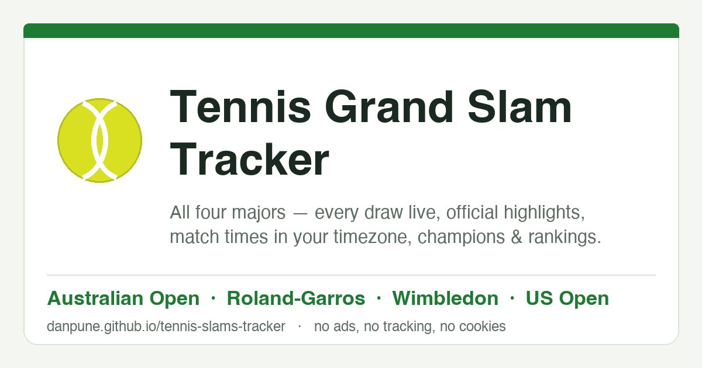
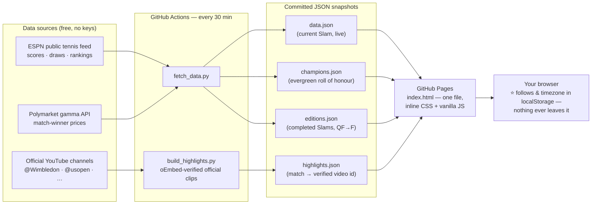

# 🎾 Tennis Grand Slam Tracker

**Live: [danpune.github.io/tennis-slams-tracker](https://danpune.github.io/tennis-slams-tracker/)**



All four tennis majors in one place, season after season — every draw live, official
highlights, match times in *your* timezone, market win-odds, champions history and world
rankings. One self-contained page. **No ads, no cookies, no tracking, no build step, no
dependencies, no API keys.**

*Sibling project of [worldcup2026](https://github.com/danpune/worldcup2026) — same
playbook (static page + scheduled fetch committing JSON snapshots), independent codebase.*

## What it does

| | |
|---|---|
| 🗓️ **Four-majors cards** | Multi-year dates with auto-rollover; completed editions show their champions — tap for a full **"how it was won"** panel (QF → F, every draw, real scores) |
| 🎾 **Live results** | All five draws with per-set scores, round chips, and a 📋 **All days** view — the whole tournament day by day |
| ▶️ **Official highlights** | Every finished singles match links to the tournament's own YouTube clip, plus a day-by-day gallery with tap-to-play embeds |
| 👤 **Players** | Photos (click to zoom), world ranking on every match row, and click any name for their **path through the Slam** |
| 🕐 **Timezones & calendar** | See match times in your zone, the venue's, or a friend's; one-tap Google/iCal adds per match |
| 📈 **Win odds** | Polymarket match-winner prices on upcoming matches (informational only, not betting advice) |
| ⭐ **Follow** | Star players & countries — stored only in your browser |
| 🏆 **Roll of honour** | Champions of every edition, appended automatically the moment each final ends |

## How it works



The page is **static**; all data work happens in the scheduled fetch. The live feed only
carries the *current* tournament, so anything worth keeping is written to append-only
files the moment it happens — champions to `champions.json`, each finished Slam's
business end to `editions.json`. Those files are the site's permanent memory.

## Design principles

- **Fail-safe everywhere.** Every writer is merge-only and never replaces good data with
  a failed or empty fetch. If a source breaks, the site degrades gracefully — it never breaks.
- **Never fabricate sports data.** Champions, scores, dates and rankings are fetched and
  verified or not shown at all. (There's no free head-to-head source, so there's no
  head-to-head feature — rather nothing than something invented.)
- **Trust, but verify the source.** Highlight links are checked against YouTube's oEmbed
  `author_url` so only the tournament's *official* channel can ever appear —
  `author_name` is spoofable; the URL isn't.
- **Privacy as a feature.** No cookies, analytics, accounts or tracking. The browser's
  only external requests are player photos (ESPN), highlight thumbnails (YouTube,
  embeds load on tap via the cookie-less domain) and one anonymous visit-counter ping.
- **Boring on purpose.** One HTML file, system fonts, no framework, no build. The whole
  site can be read in one sitting and hosted anywhere.

## Run it locally

```bash
python3 fetch_data.py            # refresh data.json (+ champions/editions when finals land)
python3 build_highlights.py      # fill verified official highlight links
python3 -m http.server 4600      # open http://localhost:4600
```

Backfill a Slam that finished before the site existed (ESPN serves historical snapshots):

```bash
python3 build_editions.py 20260201 20260607   # final-weekend dates
```

## Data sources & attribution

Results, draws and rankings via ESPN's public tennis feed (unofficial); schedules per the
official tournament sites; win probabilities are Polymarket market prices — informational
only, **not betting advice**. Not affiliated with the ATP, WTA, ITF, any tournament,
ESPN, YouTube or Polymarket; all trademarks belong to their owners. Nothing is hosted or
re-uploaded here — highlights link or embed from the tournaments' own channels.

## Roadmap

- Visual bracket tree (QF onward) — the "how it was won" panel covers the substance today
- Order-of-play "today" view during Slams
- 2028 dates as tournaments announce them

## License

Code is [MIT-licensed](LICENSE). Match data comes from the public sources
credited above and stays subject to their terms.
